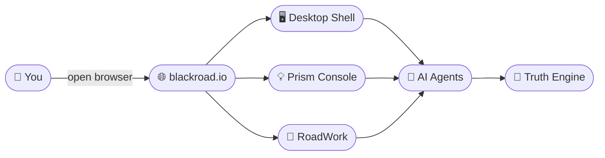
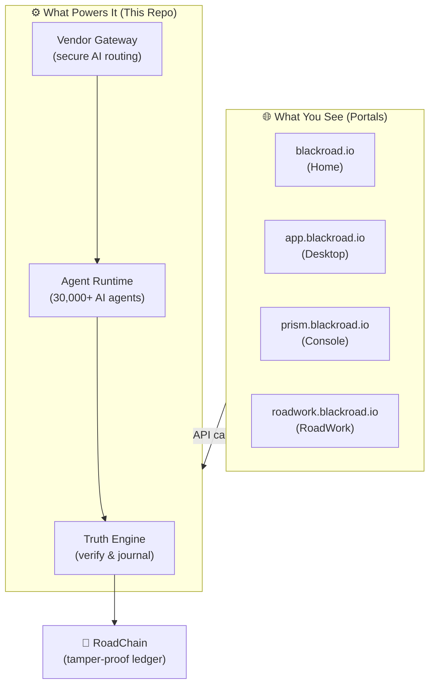
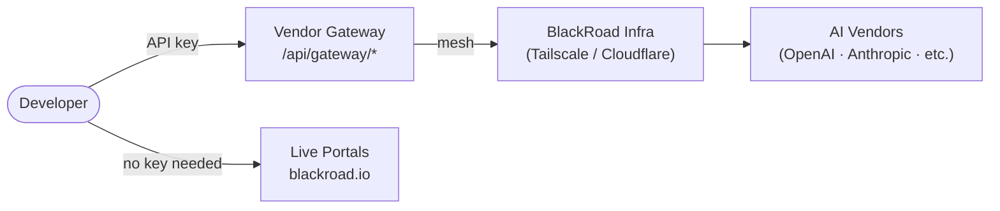

# BlackRoad OS

> **© 2025-2026 BlackRoad OS, Inc. All Rights Reserved.**

---

## ✨ Try It Now — No Setup Required

> **You don't need to install anything.** Just click a link below and it opens in your browser.

| What do you want to do? | Go here |
|-------------------------|---------|
| 🏠 **See the main experience** | **[blackroad.io](https://blackroad.io)** |
| 🖥️ **Open the OS desktop** | **[app.blackroad.io](https://app.blackroad.io)** |
| 💡 **Prism console & dashboard** | **[prism.blackroad.io](https://prism.blackroad.io)** |
| 💼 **RoadWork job hunter** | **[roadwork.blackroad.io](https://roadwork.blackroad.io)** |
| 📖 **Read the docs** | **[docs.blackroad.io](https://docs.blackroad.io)** |
| 💬 **Contact us** | **[blackroad.systems@gmail.com](mailto:blackroad.systems@gmail.com)** |

---

## What Is BlackRoad OS?

**BlackRoad OS** is a living, AI-powered operating system you can run right in your browser.

- Open it. Click around. Watch autonomous agents work for you.
- No terminal. No config files. No API keys needed to get started.
- Built for dreamers, not just developers.

---

## 🖥️ Live Portals

### [blackroad.io](https://blackroad.io) — Home
The front door. Start here if you've never used BlackRoad OS before.

### [app.blackroad.io](https://app.blackroad.io) — Desktop
A full OS-style desktop in your browser. Open apps, manage workspaces, and interact with AI agents without writing a single line of code.

### [prism.blackroad.io](https://prism.blackroad.io) — Prism Console
A real-time dashboard showing what your agents are doing, system health, and live metrics. Think of it as mission control.

### [roadwork.blackroad.io](https://roadwork.blackroad.io) — RoadWork
An AI-powered job hunter that searches, organizes, and tracks job applications for you automatically.

### [docs.blackroad.io](https://docs.blackroad.io) — Documentation
Everything you need to know, written in plain English.

---

## 🗺️ How It All Fits Together

This repository (`blackroad-os-core`) is the **engine** behind all the portals above. You never need to look at this code to use BlackRoad OS — it just powers everything.

---

## 🔑 Want to Build on Top of BlackRoad OS?

If you're a developer who wants to integrate or contribute:

1. **Email us** at [blackroad.systems@gmail.com](mailto:blackroad.systems@gmail.com) to request a Converter API key
2. **Clone this repo** and copy `.env.example` → `.env`
3. **Set your key**: `BLACKROAD_CONVERTER_API_KEY=<your-key>`
4. **Run**: `pnpm install && pnpm dev`

All agent calls, vendor routing, and truth-engine operations flow through the API at port `4000`.

> ⚠️ A Converter API key is required for all API access. External AI providers (OpenAI, Anthropic, etc.) do not have direct access to BlackRoad infrastructure.

---

## 🧭 Architecture (for developers)

### API Quick Reference

| Endpoint | What it does |
|----------|-------------|
| `GET /health` | Is the service running? |
| `GET /api/status` | Infrastructure status |
| `POST /api/truth/submit` | Submit text for AI verification |
| `GET /api/agents` | List active agents |
| `POST /api/agents/spawn` | Start a new AI agent |
| `GET /api/payments/products` | See available plans |

---

## Tech Stack

| Layer | Technology |
|-------|-----------|
| Portals | Next.js · Cloudflare Pages |
| API | Hono (TypeScript) |
| Agents | Python 3.11+ |
| Database | Prisma / PostgreSQL |
| Infra | Railway + Cloudflare |
| Auth | Clerk |
| Payments | Stripe |

---

## License

**Proprietary — © 2025-2026 BlackRoad OS, Inc. All Rights Reserved.**

See [LICENSE.md](./LICENSE.md) for complete terms.

---

**BlackRoad OS, Inc.**
[blackroad.systems@gmail.com](mailto:blackroad.systems@gmail.com) · [github.com/BlackRoad-OS](https://github.com/BlackRoad-OS) · [blackroad.io](https://blackroad.io)

