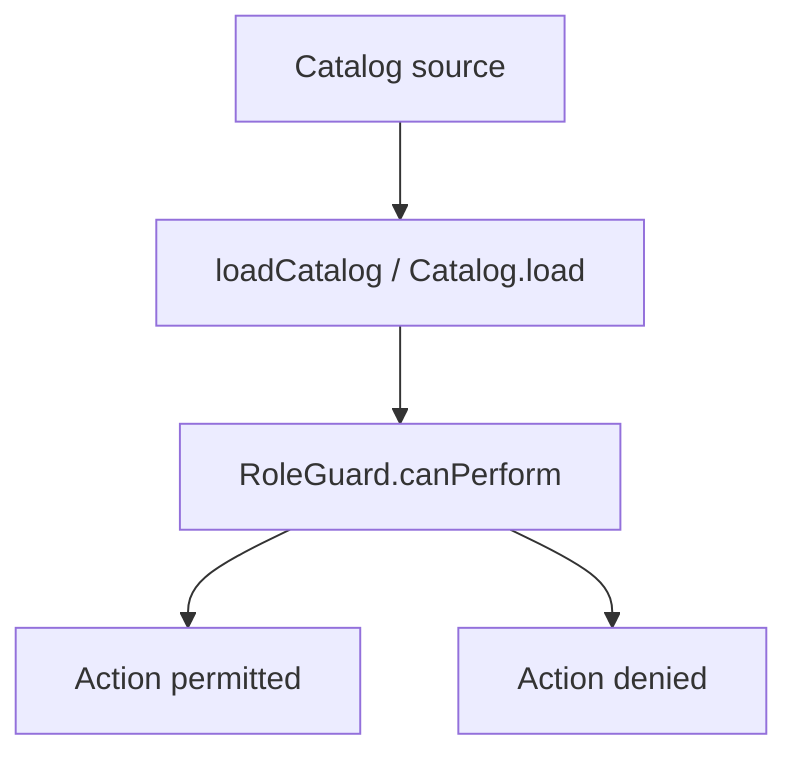

# SDK API Reference

This document summarizes the exported APIs for the TypeScript and Python SDKs.

## TypeScript
- `loadCatalog(source?: string): Promise<Catalog>`
- `getAgent(id: string, catalog: Catalog): Agent | null`
- `RoleGuard(roles: string[], policyPath?: string)` with `canPerform(action, resource)`
- `generateOrgChartSVG(catalog: Catalog): string`

## Python
- `Catalog.load(source: Optional[str]) -> Catalog`
- `RoleGuard(roles: List[str], policy_path: Optional[str])`
- `Catalog.generate_org_chart_svg() -> str`

